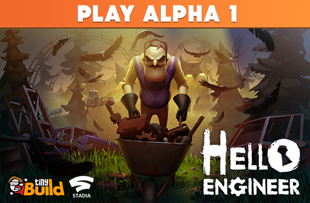

Hello Engineer alpha 1.0
=============================

 STATUS:

        start cloused alpha 1.0

Hello Engineer is a multiplayer machinery-building construction game set in the Hello Neighbor universe. Scavenge, craft and overcome challenges in the sandbox world of a mysterious amusement park. Put together incredible machines built of scrap, and beware of the Neighbor.

© 2021 tinyBuild LLC
Hello Engineer | Video Game
