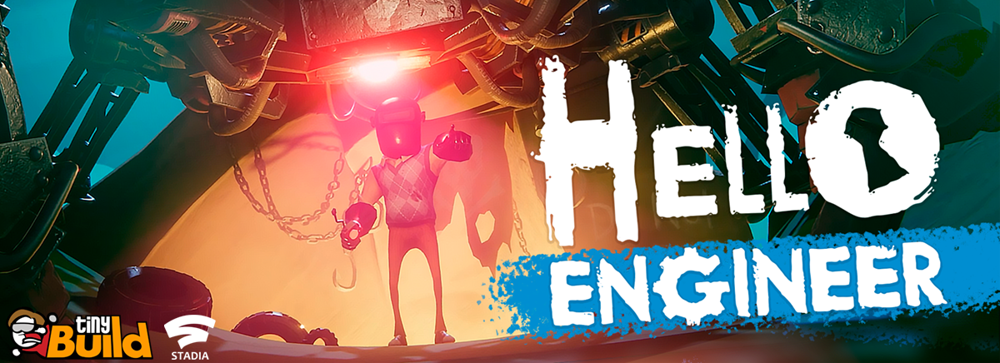

Hello Engineer alpha 1.01
=============================

Hello Engineer is a multiplayer machinery-building construction game set in the Hello Neighbor universe. Scavenge, craft and overcome challenges in the sandbox world of a mysterious amusement park. Put together incredible machines built of scrap, and beware of the Neighbor.

 STATUS:
-----------

      • 25.02 start cloused alpha build 1.0 
      • 02.03 update alpha build 1.01

PATCH 1.01: changelog
---------------------
Hello everyone! Today we bring you Build 1.01 and here are the changes:

      • Added a new menu at the start. You can now restart acts or start a new game if you have save issues. You can also select acts.
      • Slight tweaks to the maps - level design, lighting, visual cues for puzzles
      • Steam achievements are now working correctly
      • Fixed a problem where static shadows wouldn't appear for trees
      • Improved overall performance and stability
      • Optimized the lighting

Update on rare Fatal Error on start. We're working on a solution. Good news though is that you can now run as administrator.

QUICK START:
-----------

        1)Go /helloengineer/Hello Engineer Alpha 1/
        2)Download HelloEngineerAlpha.zip
        3)Instal Hello_Engineer_Alpha.exe
        !!!Windows 7/10 only!!!
        
        
BUG REPORTING:
--------------
        Please email to bugreporting@tiny-build.com   

© 2021 tinyBuild LLC
Hello Engineer | Video Game
